<div align="center">


<p>


</p>

</div>

# 💻 Terminal

```bash
$ whoami
Afiq Nazir

$ role
AI Engineer • Full Stack Developer

$ stack
TypeScript • Node.js • Python • React • PostgreSQL • Docker

$ focus
Building scalable AI products, APIs and automation.
```

## ⚙️ Tech

<p align="center">

</p>

## 📊 Analytics

<p align="center">


</p>

<p align="center">

</p>

<p align="center">

</p>

<p align="center">

</p>

## 🐍 Contribution Snake

<p align="center">

</p>

## 📈 Metrics

<p align="center">

</p>

## ☕ Quote


